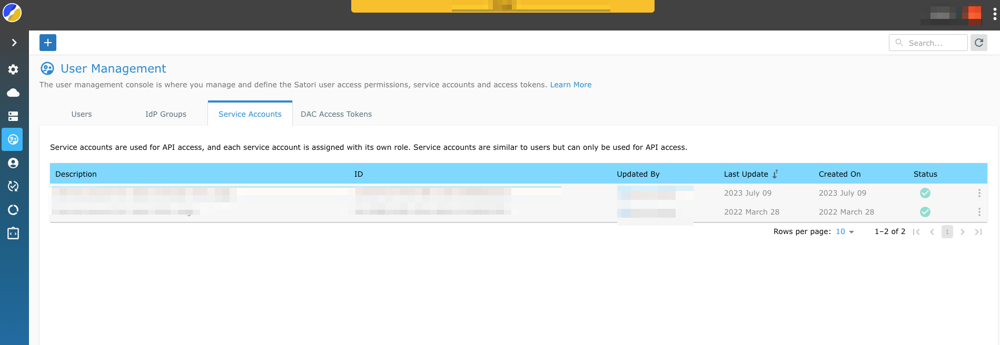
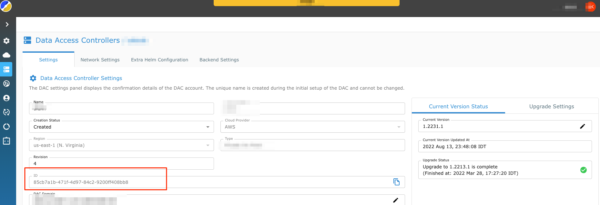

# ArgoCD integration

This is a bash script which performs the following:  

1. Discovers the latest stable version for Satori DAC.  
2. Downloads the package to a temprorary directory and extract it from the tarball.  
3. Upload the bootstrap access key to a kubernetes secret and deletes it from the installation package.  
4. Push the installation package to a git repo to a current branch.  

Note: The assumption that the git repo is tracked by ArgoCD, so the `git push` will trigger the ArgoCD helm reconciliation with the actual deployment.  
The script perfroms git push to a current branch. Consider to change it according to your company policy.

## Prerequisites

1. `kubectl` -  https://kubernetes.io/docs/tasks/tools/install-kubectl/
2. Obtain the Satori service key and export it accordingly for using it by the bash sctipt.
```
export SATORI_SERVICE_ID=<SATORI_SERVICE_ID>
export SATORI_SERVICE_KEY=<SATORI_SERVICE_KEY>
```


3. Export the DAC_ID for using it by the bash script
```
export DAC_ID=<DAC_ID>
```


4 .Export the path to the cloned git repo. The package will be copied to that repo and pushed to master.
```
export REPO_PATH=<REPO_PATH>
```
5. The kube .config file is configured. The cluster context is set to the desired kubernetes cluster.

6. Make sure with Satori suport that you have thse values in your Helm chart.
```
runtimeConf:
  dacInstaller:
    # When helm runs it won't create the bootstrap access key in kubernetes, kubernetes secret store should be populate with the secret in another manner
    installSecret: false
  dacManager:
    # For argoCD, dac-manager reports version based on static value in the helm chart and not dynamic 
    versionReporter:
      static:
        enabled: true 
```

## How to run
1. Make sure you are authenticated to the kubernetes cluster and .kubecofnig is set to the right cluster contex.
2. Run the script
```
./get_satori_installation_package.sh
```

