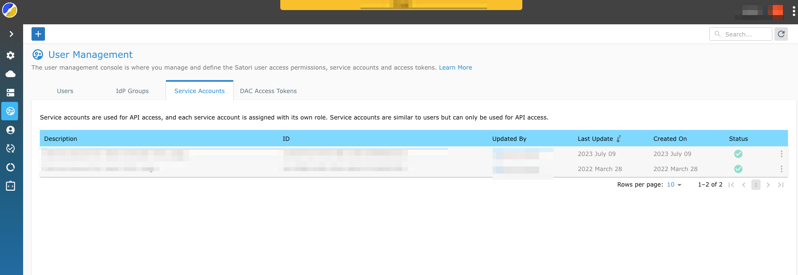
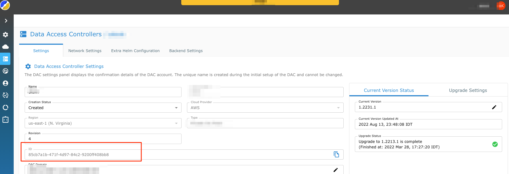

# ArgoCD integration

This is a bash script which performs the following:  

1. Discovers the latest stable version for Satori DAC.  
2. Downloads the package to a temprorary directory and extracts it from the tarball.  
3. Push the installation package to a git repo to a current branch.  

## ArgoCD Notes  

1. Make sure that the ArgoCD apply the helm chart with the following value files and in exact order:  

   Option A, providing  the `<SATORI_SERVICE_ID>` and `<SATORI_SERVICE_KEY>` as parameters to the helm command: `--values version-values.yaml --values customer-values.yaml --values customer-override.yaml --set service_accountid=<SATORI_SERVICE_ID> --set service_account_key=<SATORI_SERVICE_KEY>`

   Option B, storing the `<SATORI_SERVICE_ID>` and `<SATORI_SERVICE_KEY>` as a kubernetes secret, e.g.:
   ```
   "service_account.json" : "{"id": "<service-account-id>", "key": "<service-account-key>"}"
   ```
   To use the secret by helm chart specify the following helm parameters: `--values version-values.yaml --values customer-values.yaml --values customer-override.yaml --set service_account_secret=<SERVICE_ACCOUNT_SECRET_NAME>`.
   See [here](#External-secrets-operator-integration) on how to integrate the [external-secret operator](#External-secrets-operator-integration) with Satori helm chart to create service_account_secret dynamically.  
2. The `<SATORI_SERVICE_ID>` and `<SATORI_SERVICE_KEY>` should be obtained from the Satori management console. Since these parameters are sensitive, you must store them in a secured store and provide them to the ArgoCD dynamically.

Note: The assumption that the git repo is tracked by ArgoCD, so the `git push` will trigger the ArgoCD helm reconciliation with the actual deployment.  
The script performs git push to a current branch. Consider changing it according to your company policy.  

A sample for the ArgoCD application defitinition for Satori DAC deployment:  
```
apiVersion: argoproj.io/v1alpha1
kind: Application
metadata:
  name: satori-runtime
  namespace: satori-runtime
spec:
  project: satori-runtime
  source:
    chart: satori-runtime
    repoURL: https://my-github-repo.github.io/satori-runtime
    targetRevision: 1.2415
    helm:
      releaseName: runtime
  destination:
    server: "https://kubernetes.default.svc"
    namespace: satori-runtime
```  

## Prerequisites

1. Obtain the Satori service key and export it accordingly for using it by the bash script and the ArgoCD.
```
export SATORI_SERVICE_ID=<SATORI_SERVICE_ID>
export SATORI_SERVICE_KEY=<SATORI_SERVICE_KEY>
```


2. Export the DAC_ID for using it by the bash script
```
export DAC_ID=<DAC_ID>
```


3 .Export the path to the cloned git repo. The package will be copied to that repo and pushed to master.
```
export REPO_PATH=<REPO_PATH>
```
4. The kube .config file is configured. The cluster context is set to the desired kubernetes cluster.

5. Make sure with Satori suport that you have thse values in your Helm chart.
```
runtimeConf:
  dacInstaller:
    # When helm runs it won't create the bootstrap access key in kubernetes, kubernetes secret store should be populate with the secret in another manner
    installSecret: false
  dacManager:
    # For argoCD, dac-manager reports version based on static value in the helm chart and not dynamic 
    versionReporter:
      static:
        enabled: true 
```

## How to run
1. Make sure you are authenticated to the kubernetes cluster and .kubecofnig is set to the right cluster contex.
2. Run the script
```
./get_satori_installation_package.sh
```

## External secrets operator integration  

1. If you have the [external secret operator](https://github.com/external-secrets/external-secrets) running on your K8S cluster, you can leverage it to dynamically create the kubernetes secret with the service key required for Satori DAC deployment.  
2. Create a secret in your preferred secret manager (HasiCorp Vault, AWS secret manager, etc.). The secret could have any name, lets supposed `satori-dac-service-key`
3. Store the  `<SATORI_SERVICE_ID>` and `<SATORI_SERVICE_KEY>` in a json format  {"id": "<SATORI_SERVICE_ID>", "key": "<SATORI_SERVICE_KEY>"}  
4. The helm values file should contains the following (the values might be different, depending on your external-secrets operator implementation): 

```

runtimeConf:
  dacInstaller:
    externalSecretOperator:
      dacServiceAccountSecret: 
        create: true
        remoteRef:
          key: `satori-dac-service-key`
          property: ""
      secretStoreRef:
        name: "default-secret-store"
        kind: "ClusterSecretStore"

```
5. To enable this feature and for an additional assistance, please contact the Satori support team.  
